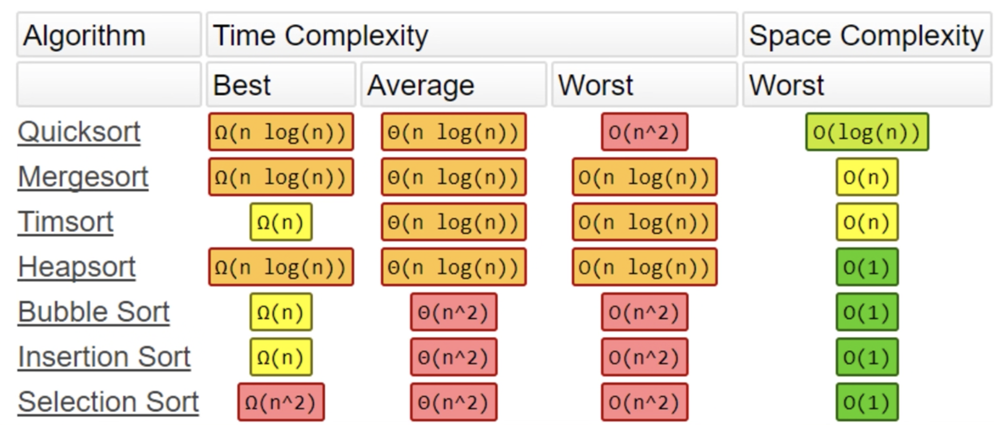

# simple_algos
Algorithms in Python

strings, arrays, trees, graphs, heaps (heapq always min heap reverse to get max)

depth-first (DFS) stack lifo (recursion is a stack always so just traverse left, then right)
breadth-first (BFS) queue fifo (queue so has to be iteratively)

think of it as an array of objects

Visualizer
https://www.cs.usfca.edu/~galles/visualization/ComparisonSort.html

